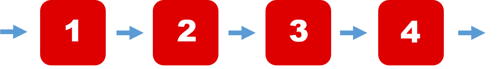

# iqueue

<h1 align="center">
  
</h1>

A generalization of stacks and queues which supports fast random memory access. iqueue combines the advantages of queues, stacks, and lists into one data structure.

- iqueue objects support memory efficient appends and pops from either side of the iqueue with the same O(1) performance in either direction.
- iqueue objects support O(1) indexing operations.

Though list objects support similar operations, they are optimized for fast fixed-length operations and incur O(n) memory movement costs for pop(0) and insert(0, v) operations which change both the size and position of the underlying data representation.

deque (doubled-ended queue available in the python collections library) objects support the same operations as iqueue objects, but for deque objects indexed access is O(1) at both ends but slows to O(n) in the middle. 

iqueue objects solve both of these problems while being able to perform the same operations available to lists, stacks, and deques without any loss in asymptotic runtime complexity.

### Example:
```ruby
>>> from iqueue import iqueue
>>> iq = iqueue([1, 2, 'x', 'y'])             # make a new iqueue with 4 items
>>> print(iq)
[1, 2, 'x', 'y']
>>> for elem in iq:                           # iterate over the iqueue's elements
...     print(elem)
1
2
x
y

>>> iq.append(-1)                              # add a new entry to the right side - O(1)
>>> iq.appendleft('w')                        # add a new entry to the left side - O(1)
>>> iq
iqueue(['w', 1, 2, 'x', 'y', -1])

>>> iq.pop()                                  # return and remove the rightmost item - O(1)
-1
>>> iq.popleft()                              # return and remove the leftmost item - O(1)
'w'

>>> list(iq)
[1, 2, 'x', 'y']
>>> iq[2]                                     # access the 2nd item - O(1)
'x'

>>> del iq[2]                                 # delete the 2nd item - O(n)
>>> print(iq)
[1, 2, 'y']
```
